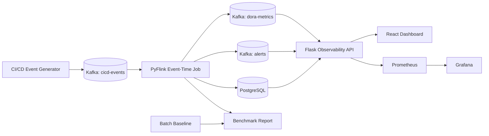

# Architecture

Events carry both event timestamps and processing timestamps. Flink assigns a
five-minute watermark to tolerate delayed and out-of-order pipeline events while
still producing low-latency DORA windows.

